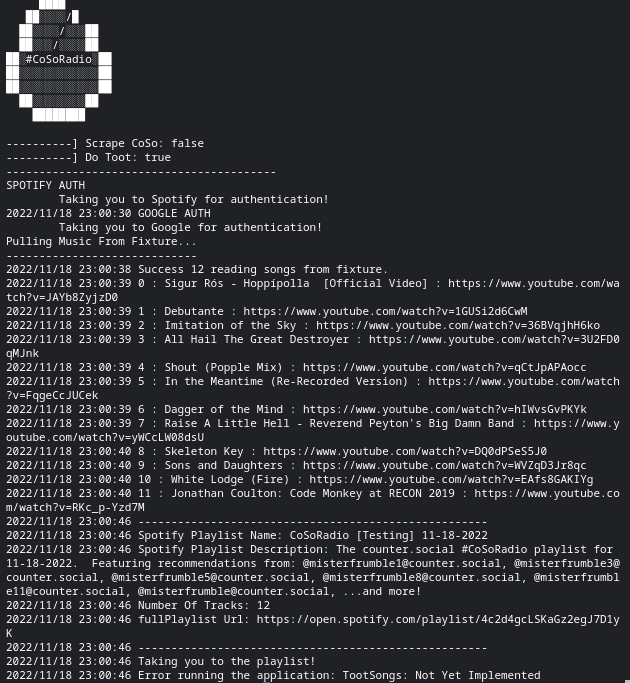

# CoSoRadio
TL;DR: Eventualyl this will scrape [counter.social](https://counter.social) firehose for posts using the `#CoSoMusic` hashtag. For each one, ff they have a YouTube link as well, get the Title from the YouTube video and then add the song to a public Spotify playlist and share it out on CoSo.

## TechStack
Language: Golang

APIs: Spotify, YouTube [Future: counter.social]

Runs: Locally (for now). Due to Spotify's authentication scheme, you're forced through a web login. There's no way to do a "headless" API integration with spotify that I've found yet. More research needed into that for both Spotify and Google APIs.

## Build and Run
```
$ cd cmd
$ go build .
$ GOOGLE_ID=<GOOGLE ID> \
  GOOGLE_SECRET=<GOOGLE SECRET> \
  SPOTIFY_ID=<SPOTIFY ID> \
  SPOTIFY_SECRET=<SPOTIFY SECRET> \
  CSM_MAKE_PLAYLIST=true \
  CSM_DO_TOOT=true \
  CSM_SCRAPE_COSO=true \
  ./cmd
```

### Workflow
1. Auth to Spotify and create Spotify Client
2. Auth to Google and create Google API Service
3. Pull music from source
    * This is just a .json file fixture for now
    * Will eventually scrape CoSo for the `#CoSoMusic` hashtag, any posts with that hashtag and a YouTube link will be added as a Song object to a slice.
4. Given the slice of Song objects, take the YouTubeUrl, look it up with the YouTube API, and get the title and tags from the video and add them to the correct Song object.
5. Create an empty Spotify playlist
6. For each Song, search for the Title + First Tag in Spotify
7. Add the resulting songs to the playlist
8. *Eventually:* Post the Spotify Playlist to CoSo as `#CoSoRadio`

Run this once a day. Eventually I'll see if I can't get it running once a day as a cloud function in GCP.



### Required Envs

* SPOTIFY_ID : The spotify ID [App set up with a redirect url of `http://localhost:8080/callback`]
* SPOTIFY_SECRET : The spotify Secret
* GOOGLE_ID : Google API Key ID [Oauth2 with scope to read only from youtube api]
* GOOGLE_SECRET: Google API Secret

**Coming Soon**

* COSO_ID
* COSO_SECRET

### Options

* CSM_MAKE_PLAYLIST : when =true will make the spotify playlist. Defaults to false
* CSM_DO_TOOT : when =true will send the toot to coso [Not Yet Implemented]. Defaults to false
* CSM_SCRAPE_COSO : when =true will scrape coso for #CoSoMusic hashtag for the previous day. when =false will pull from /cmd/Fixtures/songs.json. Defaults to false.